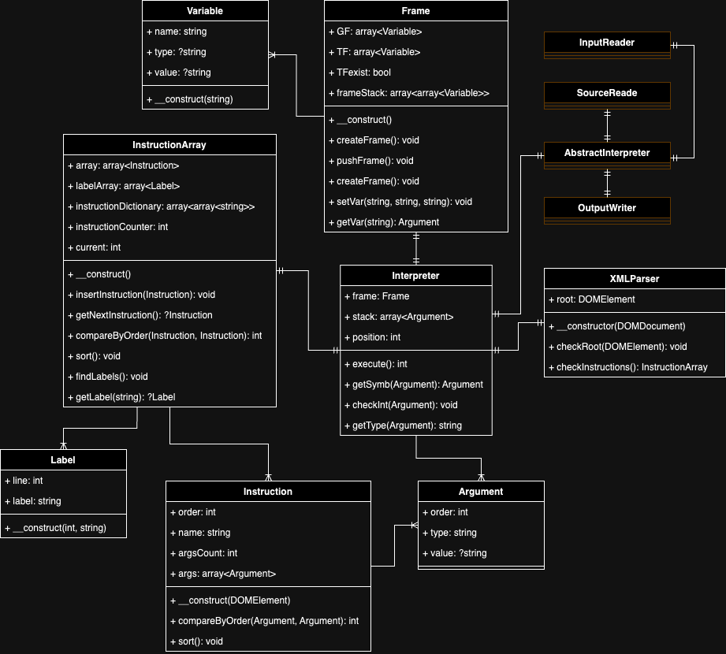

Implementační dokumentace k 2. úloze do IPP 2023/2024  
Jméno a příjmení: Ján Findra  
Login: xfindr01

## Návrh

### UML diagram



### Obsah repozitáru

- `Argument.php`
- `Frame.php` obsluha rámcov
- `Instruction.php`
- `InstructionArray.php` zoznam inštrukcií
- `Interpreter.php` hlavná časť programu
- `Label.php`
- `readme2.php`
- `UML.png` UML diagram
- `Variable.php`
- `XMLParser.php` parser vstupného XML

#### Excetions
- `FrameAccessException.php`
- `InvalidSourceStructureException.php`
- `OperandTypeException.php`
- `OperandValueException.php`
- `SemanticException.php`
- `StringOperationException.php`
- `ValueException.php`
- `VariableAccessException.php`

Výnimky nie sú v samostatnom priečniku, lebo sa mi nepodarilo vyriešiť problém s namespace-ami.

### Spracovanie vstupu

Ako prvé sa spracuje vstupný XML súbor. Vykoná sa kontrola správnych názvov a organizácie XML súboru.

### Načítanie a príprava inštrukcií

Počas kontorly vstupu sa načítaju inštrukcie ako objekty triedy Instruction, ktoré sú neskôr zoradené v zozname v objekte triedy InstructionArray. Vytvorí sa aj zoznam návestí, pre neskoršie vykonávanie skokov v inčtrukciách.

### Vykonávanie inštrukcií

V "slovníku" inštrukcií je uložený názov a typy argumentov inčtrukcií. Tento "slovník" sa využije pre kontorlu počtu a správnych typov argumentov ešte pred vykonávaním inštrukcií. Ak je typ argumentu oznčený ako `Symb`, tak sa táto kontrola preskakuje.
Pre spracovanie argumentov označených `Symb` sa používa funckia `getSymb`, ktorá skontroluje správnosť argumentu a v prípade premennej načíta hodnotu zo správneho rámca.  
Pomocou switch-u prejde program cez všetky podporované inčtrukcie a vykoná úkon spojený s danou inštrukciou.

### Práca s rámcami a premennými

Funkcie na prácu s premennými sú implementované v triede Frame. Globálny rámec je len jeden, takže práca s ním je vcelku triviálna. Problematická je správa dočasných a lokálnych rámcov. Pri vytvorení dočasného rámca sa nastaví premenná `TFexist` na true. Pri dávaní dočasného rámcu do zásobníka rámcov sa táto premenná zmení na false a pri vybraní zo zásobnika na true. Pre prístup k lokálnemu sa rámcu sa vyberie vždy najvrchnejší rámec zo zásobníka rámcov.

## Testovanie

Pre testovanie som používal manuálne púšťanie programu s referenčným vstupom a zdrojom a kontroloval som správnosť výsledku.  
Na systematické testovanie som použil dostupné testovacie sady od mojich kolegov z ročníka. Nie všetky testy boli úplne validné. Pri sade, ktorá sa mi najviac osvedčila, som dosiahol výsledok:  
```
PASSED: 361
FAILED: 2
```


## Známe problémy
1. Získanie typu neinicializovanej premennej. Podľa definície by mal byť výsledok prázdny reťazec. Moja implementácia ukončuje program s návratovou hodnotou 56.
